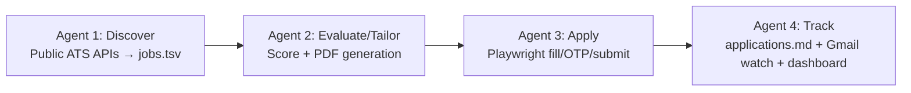

# Fillow Agent Graph

## Overview
Fillow is a hybrid, scheduled, multi-agent job-application workflow with four primary agents that operate in a specific sequence. The system splits execution between GitHub Actions (for lightweight operations) and the local machine (for resource-intensive operations) to stay within GitHub Actions minute limits.

## Agent Details

### Agent 1: Discover
- **File**: `agents/discover.mjs`
- **MyGreenhouse Variant**: `agents/discover-mygreenhouse.mjs`
- **Exports**: `scrapeJobs(cfg, emit)`, `matchesTargets(job, targets)`, `livenessVerdict(liveness)`
- **Function**: 
  - Scrapes public ATS APIs (Greenhouse, Lever, Ashby, etc.)
  - Outputs to `data/jobs.tsv` (score metadata only)
  - In hybrid model: Runs on GitHub Actions (online)
  - Local execution: `fillow discover` or `fillow scrape`

### Agent 2: Evaluate/Tailor
- **File**: `agents/evaluate-tailor.mjs`
- **MyGreenhouse Variant**: `agents/evaluate-mygreenhouse.mjs`
- **Exports**: `evaluateTailor(cfg, opts)`, `scoreOnlyRequested(argv, env)`
- **Function**: 
  - **Phase 2a (Score/Gate)**: Heuristic scoring, legitimacy checks, location gates
  - **Phase 2b (Tailor)**: Generates 1-page Jake's Resume PDF + cover letter per job (Playwright print-to-PDF)
  - Outputs: Updates `data/jobs.tsv` with status, creates `data/tailored/` PDFs
  - In hybrid model: 
    - 2a (score/gate) runs on GitHub Actions (online)
    - 2b (PDF generation) runs locally (offline) - **never** on Actions
  - Local execution: `fillow evaluate` (--score-only skips PDFs)

### Agent 3: Apply
- **File**: `agents/apply.mjs`
- **MyGreenhouse Variant**: `agents/apply-mygreenhouse.mjs`
- **Exports**: `applyJobs(jobs, cfg)`
- **Function**:
  - Playwright-based form filling
  - Handles OTP challenges
  - Manages submit gates
  - Outputs: Updates `data/applications.md`
  - In hybrid model: Runs locally (offline) only - **never** on Actions
  - Local execution: `fillow apply`

### Agent 4: Track
- **File**: `agents/track.mjs`
- **MyGreenhouse Variant**: `agents/track-mygreenhouse.mjs`
- **Exports**: `trackDashboard(results, cfg)`
- **Function**:
  - Tracks application status in `data/applications.md`
  - Watches Gmail for replies (IMAP)
  - Generates `output/dashboard.html`
  - In hybrid model: Runs locally (offline) only
  - Local execution: `fillow track`

## Execution Flows

### Hybrid Mode (Default)
```mermaid
flowchart LR
    subgraph GitHub Actions[GitHub Actions (Online)]
        A1[Agent 1: Discover<br/>Public ATS APIs → jobs.tsv] --> A2a[Agent 2a: Score/Gate<br/>jobs.tsv → status: ready|report_only|below_threshold]
    end
    
    subgraph Local Machine[Local Machine (Offline)]
        A2b[Agent 2b: Tailor<br/>Generate PDFs + cover letters] --> A3[Agent 3: Apply<br/>Playwright fill/OTP/submit] --> A4[Agent 4: Track<br/>applications.md + Gmail watch + dashboard]
    end
    
    A2a -->|Artifact: jobs.tsv| A2b
```

### Local-only Mode


### MyGreenhouse Lane (When Enabled)
```mermaid
flowchart LR
    subgraph GitHub Actions[GitHub Actions (Online)]
        MGH1[Agent 1-MGH: Discover<br/>Logged-in MyGreenhouse → jobs.tsv] --> MGH2a[Agent 2-MGH: Evaluate<br/>Score/mgh:* rows]
    end
    
    subgraph Local Machine[Local Machine (Offline)]
        MGH2b[Agent 2-MGH: Tailor<br/>PDF generation] --> MGH3[Agent 3-MGH: Apply<br/>MyGreenhouse apply flow] --> MGH4[Agent 4-MGH: Track<br/>sync]
    end
    
    MGH2a -->|Artifact: jobs.tsv| MGH2b
```

## Command Mapping

| Command | Agents Executed | Location | Notes |
|---------|----------------|----------|-------|
| `fillow online` | Agent 1 + Agent 2a | GitHub Actions | discover + score/gate only |
| `fillow pull` | — | Local | downloads jobs.tsv artifact |
| `fillow offline` | Agent 2b + Agent 3 + Agent 4 | Local | PDFs + apply + track |
| `fillow run` | Agent 1 + Agent 2 + Agent 3 + Agent 4 | Local | all four agents |
| `fillow discover` | Agent 1 | Local | public ATS APIs |
| `fillow evaluate` | Agent 2 | Local | score + tailor (--score-only skips PDFs) |
| `fillow apply` | Agent 3 | Local | Playwright apply |
| `fillow track` | Agent 4 | Local | tracker + Gmail + dashboard |
| `fillow mgh *` | MyGreenhouse variants | Local/BrowserSkill | requires logged-in Chrome extension |

## Data Flow

1. **Input**: `config/profile.yaml` (identity facts), `.env` (secrets)
2. **Agent 1**: Produces `data/jobs.tsv` (raw job postings + score metadata)
3. **Agent 2**: 
   - Consumes `data/jobs.tsv`
   - Produces updated `data/jobs.tsv` (with status flags)
   - Produces `data/tailored/` (PDF resumes/cover letters)
4. **Agent 3**: 
   - Consumes `data/jobs.tsv` (filtered to ready jobs) + `data/tailored/`
   - Produces updates to `data/applications.md`
5. **Agent 4**: 
   - Consumes `data/applications.md`
   - Produces `output/dashboard.html` + Gmail watch
   - Maintains `data/blacklist.md`

## Important Constraints

- **Source of Truth**: Local files (`config/profile.yaml`, `.env`, `data/applications.md`, etc.) are always authoritative
- **Isolation**: Agents are side-effect-isolated per job - one job failing doesn't block the batch
- **DRY_RUN**: Defaults to true; must be reviewed before setting to false for actual submissions
- **Anti-spam Pacing**: Humanized delays, per-board delays, and run caps prevent instant-autofill flags
- **MyGreenhouse**: Requires BrowserSkill + Chrome extension; separate lane from public ATS agents

## Validation

Each agent includes error handling and validation:
- Agent 1: Validates job data structure, filters by targets
- Agent 2: Applies scoring gates, generates PDFs only for approved jobs
- Agent 3: Handles form submission gates, OTP challenges
- Agent 4: Atomic writes to applications.md, Gmail reply correlation

This agent graph represents the core workflow architecture of the Fillow system as implemented in the repository.